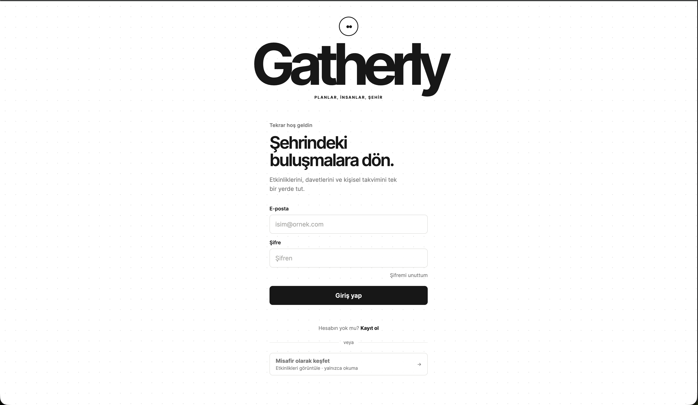
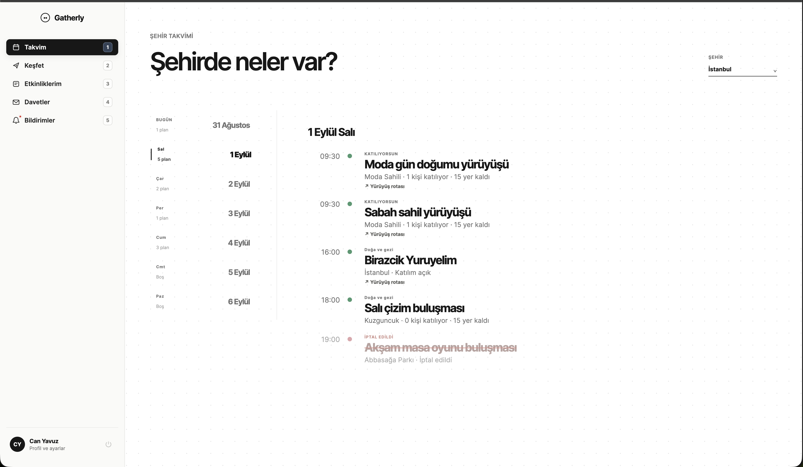
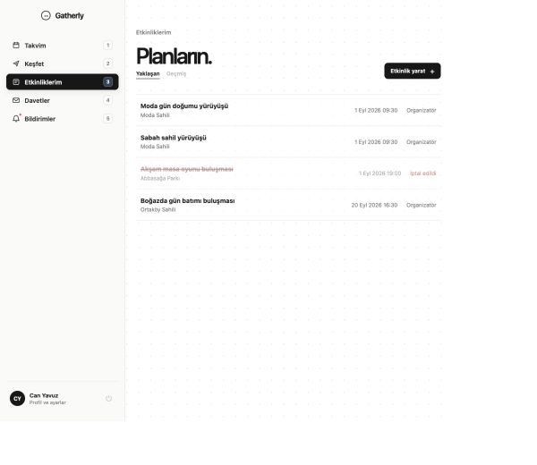
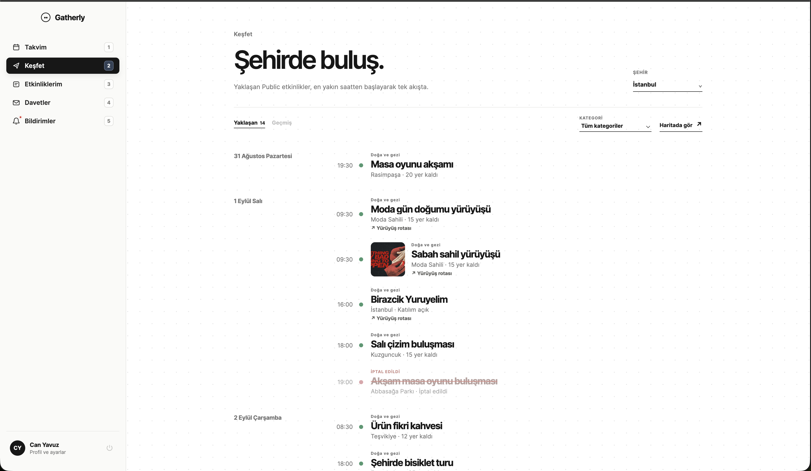
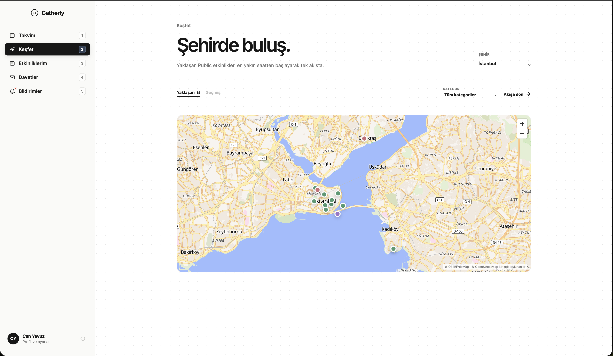
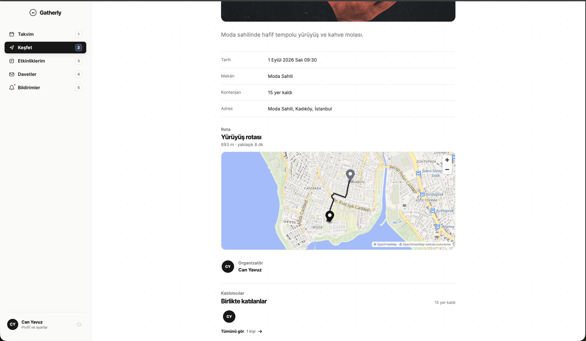
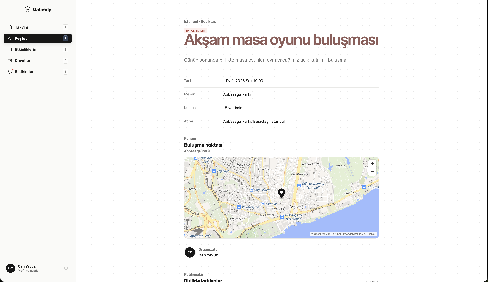
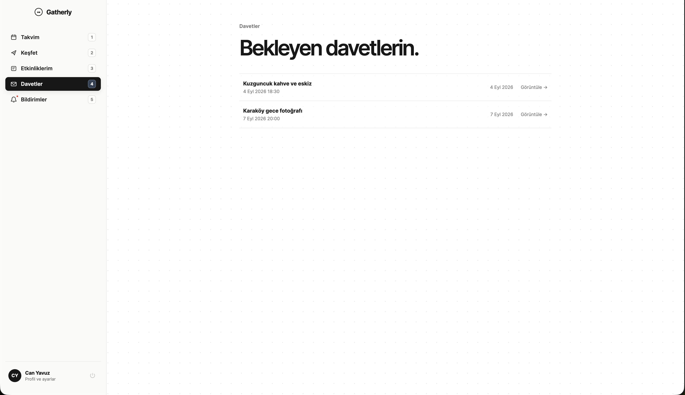
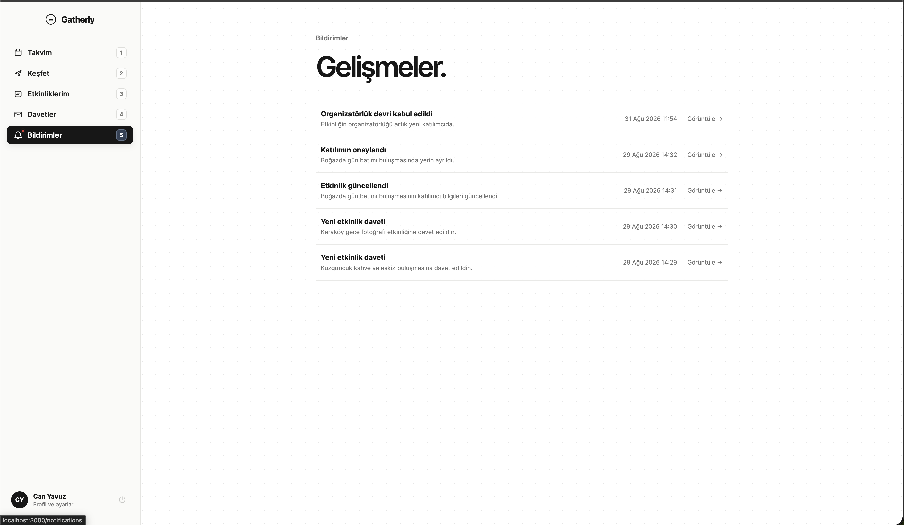

# Gatherly

Gatherly is a local-events platform for finding, creating, and managing community plans. It pairs a deliberately quiet, calendar-first web experience with a transactional API: capacity, invitations, attendance, cancellations, and organizer handover remain consistent when several people act at once.

> **Status — local product build.** Gatherly is not deployed as a public service yet. The full web app and API run locally with Docker Compose; this repository contains the code, migrations, API reference, and setup instructions needed to review it.

## What is implemented

- Public discovery and personal calendar views, including upcoming and historical plans.
- Filters for city, district, date, and category across all 81 Turkish cities.
- Event creation with public, unlisted, and private visibility; open, approval-required, and invite-only participation.
- Map-based point selection, optional start/end routes, route summaries, and route details on the event page.
- RSVP states, capacity accounting, waitlist promotion, invitations, in-app notifications, and real-time update signals.
- Organizer tools: cancellation, participant roster, and organizer-transfer request/accept/decline flow.
- Account lifecycle: registration, email verification, sign-in/out, password reset, profiles, privacy, and guest browsing with authenticated-action prompts.
- Event history and cancelled-event states that remain readable instead of silently disappearing.

## Product walkthrough

The following screens were captured from the local product build using the Can Yavuz account. They are intentionally included so a reviewer can understand the signed-in experience without a hosted demo.

### Authentication

The entry point supports sign-in, password visibility, password recovery, registration, and read-only guest discovery.



### Can Yavuz’s calendar

A signed-in member sees daily plans, attendance state, category colours, route summaries, capacity, and cancelled-event treatment in one stream.



### My events

Organizer-owned and attended events have upcoming/history views, a creation entry point, and an explicit cancelled state rather than silent removal.



### Discovery and map view

The public city stream combines date grouping, category filters, an upcoming/history switch, capacity, concise route context, and an optional geographic view.





### Event detail and lifecycle state

Timing, capacity, access-safe address data, route distance/duration, the generated path, organizer, and participants are available from the event page. A cancelled plan stays readable and visibly distinct; new participation and management actions are unavailable.





### Invitations and notifications

Pending invitations expose the event, date, and a direct path to the protected detail without exposing unrelated events. In-app notifications surface attendance, invitation, revision, and organizer-transfer outcomes, each linking back to current authorized event state.





## Architecture at a glance

```text
Browser (Next.js + React)
        │ REST / Socket.IO
        ▼
NestJS modular monolith ─────► PostgreSQL
        │                         authoritative state + transactions
        ├────► RabbitMQ ───────► notifications / realtime consumers
        └────► MapTiler + openrouteservice (optional location integrations)
```

The API makes attendance and capacity decisions inside PostgreSQL transactions. Messaging happens after a successful commit; Socket.IO communicates that persisted state changed, and clients re-fetch the authorized projection. This keeps a final-seat RSVP, an invitation acceptance, or a waitlist promotion from producing contradictory capacity.

## Technology

| Concern | Choice |
| --- | --- |
| Web | Next.js 16, React 19, TypeScript, MapLibre GL |
| API | NestJS 11, TypeScript, TypeORM, Swagger/OpenAPI |
| Data | PostgreSQL 16 |
| Async + realtime | RabbitMQ, Socket.IO |
| Authentication | JWT access token + rotating refresh-session cookie |
| Local services | Docker Compose, Mailpit |
| Package manager | pnpm 11 |

## Run locally

### Prerequisites

- Docker Desktop (or Docker Engine with Compose)
- Node.js 24 or newer
- pnpm 11 (`corepack enable` is the simplest way to use the pinned version)

### Quick start

```bash
git clone https://github.com/canyavuzdb/Gatherly.git
cd Gatherly
corepack enable
pnpm install
cp .env.example .env

# Start the web app, API, PostgreSQL, RabbitMQ, and Mailpit.
docker compose up --build -d

# Apply the schema before using the API.
pnpm migration:run
```

Open the following local services after the containers are healthy:

| Service | Address | Purpose |
| --- | --- | --- |
| Web application | http://localhost:3000 | Gatherly UI |
| API health | http://localhost:3001/health | Liveness check |
| API reference | http://localhost:3001/reference | Interactive OpenAPI reference |
| OpenAPI JSON | http://localhost:3001/openapi.json | Raw API contract |
| RabbitMQ management | http://localhost:15672 | Local broker console |
| Mailpit | http://localhost:8025 | Local email inbox |

The default RabbitMQ credentials are `guest` / `guest`. PostgreSQL and service defaults are in [`.env.example`](./.env.example); they are suitable only for local development.

For a faster edit loop after the infrastructure is running, use the local development servers instead:

```bash
pnpm dev
```

The host processes need a host-reachable PostgreSQL/RabbitMQ configuration. The Docker-first quick start avoids that extra configuration. See the [local-development guide](./docs/local-development.md) for environment variables, maps/routing, useful commands, and troubleshooting.

## Quality checks

```bash
pnpm build   # build web and API
pnpm lint    # lint web and API
pnpm test    # API test suite
```

The implementation also includes integration coverage around consistency-sensitive flows such as attendance and organizer transfer. These tests need a disposable PostgreSQL database through `DATABASE_URL`; run them in the configured local environment rather than against shared data.

## Repository guide

```text
apps/
  api/        NestJS modules, TypeORM migrations, API adapters, tests
  web/        Next.js pages, app-shell components, map UI
docs/
  architecture/  system, application, and persistence decisions
  modules/       module boundaries and invariants
  images/        README product snapshots
```

The deeper reasoning behind module boundaries and invariants lives in the [documentation index](./docs/README.md). Useful starting points are the [system design](./docs/architecture/system.md), [application architecture](./docs/architecture/application.md), and [data model](./docs/architecture/data-model.md).

## Current scope and next steps

Gatherly is intentionally a local, product-oriented build—not a hosted beta. Production deployment, secrets management, observability, a transactional outbox, and external delivery channels (email/push) are not yet part of the repository. Map search and route geometry are optional local integrations because they require developer-owned provider keys.

## License

License selection is pending.
