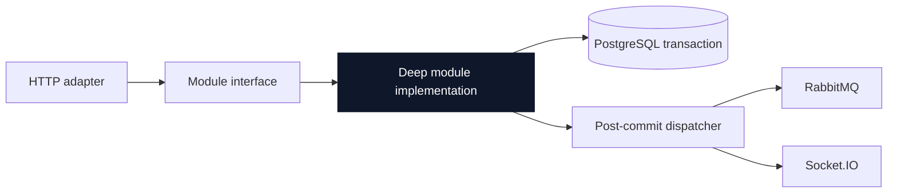
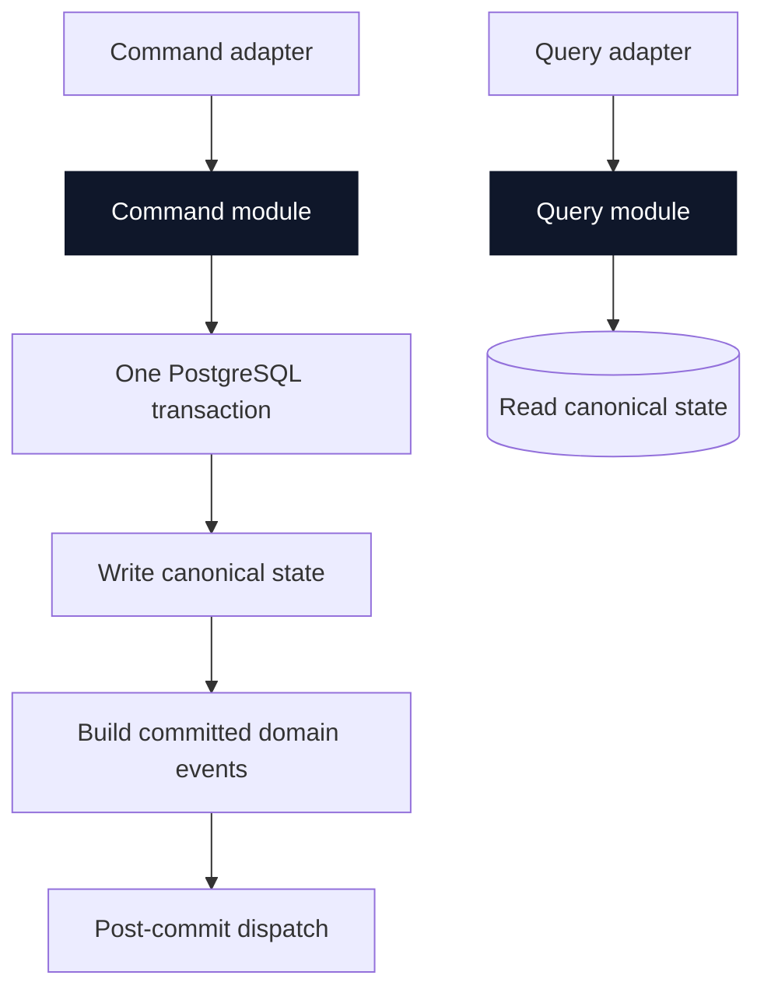
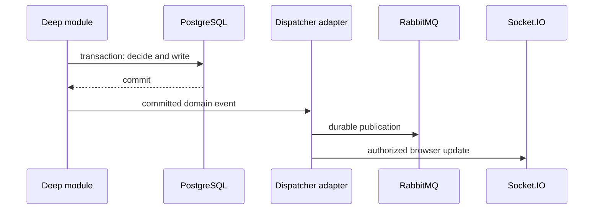

# Gatherly application architecture

> **Purpose:** define how Gatherly's code is shaped before feature implementation begins. [System design](./system.md) explains runtime behaviour; [data model](./data-model.md) explains persisted truth. This document explains the module, interface, seam, and adapter pattern that connects them.

## 1. Architectural thesis

Gatherly is a **modular monolith** built from **vertical slices**. Each slice is a domain-named module with one small public interface and a deep implementation. A caller states an intent; it does not learn table layout, transaction order, row locking, counters, or message dispatch choreography.



The module is the transaction owner for its business decision. PostgreSQL remains the source of truth; RabbitMQ and Socket.IO distribute already committed results.

## 2. Pattern stack

| Pattern | Gatherly application |
| --- | --- |
| Modular monolith | One NestJS process; domain-named modules own their own implementation and persistence access. |
| Vertical slice | A feature's HTTP adapter, interface, implementation, persistence, events, and tests stay together. |
| Command/query separation | Commands change truth; queries read and project truth. This is not separate read/write storage or event sourcing. |
| Deep modules | A small interface hides a large amount of rule, transaction, and persistence complexity. |
| Transaction owner | Exactly one module owns every operation that can alter an invariant. |
| Post-commit distribution | RabbitMQ and Socket.IO receive a committed result; neither decides business state. |

## 3. Design vocabulary

The following terms are used deliberately throughout the codebase:

- **Module:** a domain-named unit with one public interface and an implementation.
- **Interface:** everything callers and tests must know: commands, results, invariants, error modes, and ordering constraints.
- **Seam:** the location where callers cross a module's interface.
- **Adapter:** a concrete implementation at a seam, such as the HTTP adapter or the RabbitMQ dispatcher adapter.
- **Depth:** how much behaviour the module hides behind its interface.
- **Leverage:** capability gained by every caller from that depth.
- **Locality:** rules, changes, bugs, and verification concentrated in one module.

The interface is the test surface. A test should not cross past an interface to assert private implementation detail.

## 4. Module map

| Module | Public responsibility | Transaction ownership | Primary callers |
| --- | --- | --- | --- |
| `auth` | establish a User's identity, credentials, verification, and refresh sessions | registration, credential changes, verification/reset consumption, session revocation | HTTP adapter, local email adapter |
| `users` | Profile and monthly Event Creation Quota | profile changes and quota assignment | auth, Event creation |
| `events` | Event creation, metadata, Location, discovery, visibility, lifecycle | complete Draft creation with quota usage; Event metadata changes; scheduled completion | HTTP adapter, discovery queries, scheduled adapter |
| `attendance` | Attendance, Invitation eligibility, capacity, Waitlist Enrollment and promotion | every seat-changing transition | HTTP adapter, Event lifecycle work |
| `media` | Media Asset lifecycle and Event media attachment | Media Asset state; Event media attach/detach | HTTP adapter, background processing |
| `notifications` | User-facing notification records and read state | notification persistence | post-commit consumer |
| `messaging` | durable domain-event publication and consumption | none: it never owns business truth | all post-commit dispatchers |
| `realtime` | authorized rooms and browser-facing updates | none: it mirrors committed truth | post-commit dispatcher |

The `attendance` module owns any transition that can consume or release a seat. `events` owns Event metadata but never decides an Attendance outcome.

Event creation is the sole exception to this ownership sentence: `events` creates the Organizer's initial Confirmed Attendance atomically with the Event because that Attendance establishes the Event's initial capacity state. All later Attendance transitions remain owned by `attendance`.

That initial Organizer Attendance is not independently cancellable. A User may make a fresh request after cancelling their own Attendance, while an Organizer rejection can be reopened only through a valid Invitation. These are transition rules in the `attendance` implementation, not conditions an HTTP adapter re-creates.

## 5. Standard vertical-slice shape

The exact files may evolve with NestJS conventions, but every business module follows this responsibility shape:

```text
apps/api/src/<module>/
  <module>.module.ts             NestJS registration only

  <module>.interface.ts          the one public interface
  <module>.commands.ts           caller intent
  <module>.results.ts            observable outcomes
  <module>.errors.ts             named business failures

  <module>.implementation.ts     deep orchestration and rule ownership
  <module>.transitions.ts        private, pure rules when they earn their keep
  <module>.persistence.ts        transaction-aware PostgreSQL operations
  <module>.events.ts             committed domain-event construction

  <module>.http.ts               HTTP adapter: validation and result mapping
  <module>.integration-spec.ts   interface-level PostgreSQL tests
```

This is a responsibility map, not a mandate to create a file for every label. A thin file that merely forwards to another file fails the deletion test and should not exist. Private helpers stay inside the module unless their removal would spread meaningful complexity to several callers.

## 6. Interface rules

### Commands express intent

Callers request a business outcome; they never submit persistence-shaped changes.

```ts
// Good: caller states intent.
attendance.decide({
  kind: 'REQUEST_ATTENDANCE',
  eventId,
  actorUserId,
});

// Bad: caller owns the module's implementation details.
attendance.write({
  eventId,
  userId: actorUserId,
  status: 'CONFIRMED',
  confirmedCount: 17,
});
```

### Results expose committed facts

Module results describe what is now true: an Attendance status, a capacity snapshot, an Event state, or a named business failure. They do not expose an ORM entity, transaction object, row lock, or RabbitMQ payload.

### Errors are part of the interface

Expected domain outcomes use named errors or discriminated results, such as `INVITATION_REQUIRED`, `EVENT_AT_CAPACITY`, and `EVENT_NOT_JOINABLE`. Unexpected infrastructure failure remains exceptional. An HTTP adapter maps these outcomes to HTTP status codes; it does not reinterpret a business rule.

### No generic repository pattern

The first implementation has one PostgreSQL adapter. Adding a generic repository interface merely to mock it creates a hypothetical seam with little depth. Real PostgreSQL integration tests exercise the module interface and its transaction behaviour.

A persistence seam becomes justified only when two meaningful adapters exist—for example, a real adapter and a local, behaviourally faithful alternative. Until then, transaction-aware PostgreSQL operations remain private implementation detail.

## 7. Command, query, and transaction pattern



Commands take locks in a documented, stable order, validate authorization and transitions, write all affected rows, and commit once. The module builds its domain events from the committed result. Queries do not mutate domain state or trigger distribution.

When a command crosses module ownership, the transaction owner is selected by the invariant being changed:

- Event creation changes the Event Creation Quota and creates an Event, so `events` owns its transaction.
- A join, approval, cancellation, invitation acceptance, or promotion can change capacity, so `attendance` owns its transaction.
- Notification persistence reacts to a committed event and never reaches back to change an Attendance decision.

Changing Event capacity is the deliberate coordination case: the Event metadata change and an `OPEN` Event's FIFO promotion run in one PostgreSQL transaction. The promotion logic remains inside Attendance implementation; Event code does not select an Attendance or calculate a new `confirmed_count`.

Categories are platform-managed reference data; Event code validates that a selected Category is active but does not own Category administration. Organizer ownership is immutable in the MVP, so Event code never exposes an ownership-transfer command.

## 8. Messaging and realtime pattern



Every domain event uses a versioned name, such as `attendance.confirmed.v1`, and a stable envelope:

```text
message_id
event_name
event_version
occurred_at
correlation_id
causation_id
payload
```

RabbitMQ consumer implementations must be idempotent. Socket.IO is best-effort: a reconnecting browser re-reads canonical state through a query rather than relying on replay.

The MVP deliberately has no transactional outbox. A commit can therefore succeed while later publication fails; the failure is logged and PostgreSQL remains authoritative. When reliable delivery becomes a product need, an outbox is introduced behind the dispatcher seam rather than leaking into business modules.

The Notification consumer creates in-app rows only for agreed Attendance, Invitation, Event revision, and Event cancellation facts; a unique recipient/event-derived deduplication key makes repeated RabbitMQ delivery harmless without coalescing distinct committed revisions. Its presentation payload contains a target `eventId`, and the browser re-fetches current authorized truth when opened. It emits a persisted Notification summary to the authenticated `user:{userId}` room only after that write. Socket.IO sends compact committed-change signals rather than Event or Attendance truth: shared `event:{eventId}` rooms exist only for Public Events, while Unlisted/Private changes go to affected User rooms. Share tokens never enter a socket handshake or room. The client re-fetches the ordinary authorized query projection.

`messaging.publish(CommittedFact[])` is the one post-commit origin seam for business modules. `notifications` owns fact-to-Notification derivation, deduplication, list/read state, and its consumer entry; `realtime.emit(CommittedRealtimeSignal)` owns room selection and Socket.IO emission. Their concrete interfaces, order guarantees, and adapter seams are in [Notifications design](../modules/notifications.md).

## 9. Authorization and data projection

Authentication establishes the caller's User identity. Each command module then evaluates the authorization relevant to that command.

The `auth` module stores passwords as Argon2id digests, requires a minimum length of twelve plus a small versioned common-password deny list, issues a short-lived stateless access token, and manages at most five refresh sessions through hashed, revocable database records. The sixth sign-in revokes the oldest session; the MVP intentionally has no device-management interface. Registration issues the initial session even though the User is unverified; command modules enforce the Verified User rule for trust-sensitive actions rather than assuming that a valid JWT alone is sufficient. It sends verification and reset links through an email adapter; local development uses Mailpit, while the token lifecycle remains the same. Verification resend is limited to one request per User per sixty seconds.

`auth` presents two entry points: `decide(AuthCommand)` for identity life-cycle changes and `authenticate(accessToken)` for the current `UserIdentity`. The latter checks current User status as well as JWT validity, so suspension and self-deletion take effect immediately. The complete command shapes and error modes are in the [Auth design](../modules/auth.md).

The `users` module owns Profile projection and edit rules plus a User's current Event Creation Quota view. A Profile contains only name, bio, visibility, and an authorized avatar; visibility is checked on each read. The User can edit their own Profile before verification. An Organizer may read an Attendance requester's Profile to make a decision; other Users require mutual Confirmed Attendance in an Event under `EVENT_ATTENDEES`. The quota query returns only the caller's current-month used, limit, and remaining values and has no product mutation interface.

Password reset, platform suspension, and self-deletion revoke refresh sessions. Reset completion creates one fresh session for the requesting browser. A normal logout or refresh rotation affects only the presented session. Password change and self-deletion require current-password re-authentication. The refresh secret is exposed only through an `HttpOnly`, `SameSite=Lax` cookie (`Secure` outside local HTTP development). Reset and verification-resend interfaces return a generic response even when no matching account is eligible; registration alone reports an existing email. Email-address change is intentionally absent from the MVP interface. Self-deletion is rejected until the User has cancelled active future Attendances and Events they organize; it revokes the User's pending Invitations, then irreversibly pseudonymizes Profile presentation data while retaining the User identifier so historical references remain valid. A later registration with the original email creates a new User.

- `events` verifies Organizer ownership for Event management.
- `attendance` verifies Event joinability, Join Policy, Invitation eligibility, and Organizer authority for decisions.
- `media` verifies ownership and Event management rights before attachment.
- Query modules project only data the caller may view; a Socket.IO room uses the same projection rule.

Event Visibility and Join Policy remain separate concepts. An Invitation grants eligibility but never reserves capacity. Only a Confirmed Attendance consumes capacity.

Event discovery is a read-only query module, separate from the Event command interface. It lists only future Published Public Events through a required-city, optional district/Category/date query and a stable `starts_at, id` cursor (maximum fifty results). It may project only the caller's own Attendance status, capacity, and available-seat fact; inactive Categories remain on existing Event cards but do not appear as filter choices. Unlisted and Private detail authorization is evaluated before projection; general discovery never returns either. A Public Event remains directly viewable after cancellation or completion but exposes no join action. A Personal Calendar is another query that returns the User's future Organizer Event and active Attendance entries, including Cancelled cards. Free-text search, rankings, maps, recommendations, cache, a history screen, and an external search adapter are intentionally absent.

`event-discovery` presents three read-only queries: `discover`, `open`, and `personalCalendar`. It derives Viewer-specific projections from a trusted UserIdentity supplied by the HTTP adapter, not a client-supplied User id. Cursor encoding, joined projections, and authorization stay in its PostgreSQL implementation; [Event discovery design](../modules/event-discovery.md) defines the full interface and result rules.

The `media` implementation validates JPEG, PNG, and WebP image bytes and their 10 MB limit before it writes a Ready Media Asset to the local storage adapter. Storage-key generation, byte validation, and authorization-aware delivery remain behind the media interface. One User has one Profile avatar; replacement leaves its former asset ready and reusable. An Organizer attaches only their own Ready asset to a pre-start Event, which permits one Cover and five Gallery images; Cover replacement is atomic. An attached asset must be detached before deletion, while self-deletion removes all of its owner's Profile/Event Media links and marks all of their assets Deleted. The module does not introduce S3, a CDN, presigned upload, video processing, or a separate worker in the MVP.

`media` presents `decide(MediaCommand)` for mutations, `open(OpenMediaRequest)` for authorization-aware byte delivery, and `listOwned(ListOwnedMediaRequest)` for the User's image selector. Auth owns the self-deletion transaction and calls a media internal seam to retire owned assets within it; the full rules and failure modes are in the [Media design](../modules/media.md).

An Invitation's lifecycle stops governing the participation decision after acceptance: expiry or revocation prevents acceptance while pending, but never retroactively changes the resulting Attendance.

## 10. Testing shape

| Test | Crosses | Proves |
| --- | --- | --- |
| Module integration test | module interface + real PostgreSQL | constraints, locks, state transitions, counters, and atomicity |
| Adapter test | HTTP adapter + module interface | validation and result/error mapping |
| Consumer test | RabbitMQ message + notification/realtime implementation | idempotency and projection |
| End-to-end test | browser adapter through committed state | authorization, user-visible outcome, reconnect re-read |

The most valuable tests are concurrency tests. For Attendance, two calls for the final seat must cross the exact same interface and produce one Confirmed Attendance. Testing private transition helpers alone does not prove the system invariant.

## 11. Guardrails

Do not:

- split a module just because it has several files;
- create a module whose interface only forwards to another module;
- let an HTTP adapter calculate capacity or choose an Attendance status;
- let Socket.IO accept a command that changes business truth;
- publish a message before the PostgreSQL transaction commits;
- use RabbitMQ as a source of Attendance or Event truth;
- leak ORM entities, row locks, or transaction objects through a module interface;
- introduce an adapter seam when only one meaningful adapter exists.

## 12. Evolution rules

The modular monolith is intentionally an extraction-ready design, not a promise of extraction. A module earns independent deployment only when operational evidence demands it: independent scaling, different availability needs, or a distinct release cadence. Until then, keeping transactions local yields more leverage and locality than network separation.

Likewise, a new interface or adapter must pass the deletion test. If deleting it does not cause meaningful complexity to reappear in multiple callers, it is shallow and should remain internal.

## 13. Reading map

- [System design](./system.md): runtime context, invariants, critical flows, and operational stance.
- [Data model](./data-model.md): persisted tuples, constraints, and indexes.
- [Module designs](../modules/): module interfaces, state machines, and test contracts.
- [Domain glossary](../domain-glossary.md): canonical Gatherly language.
