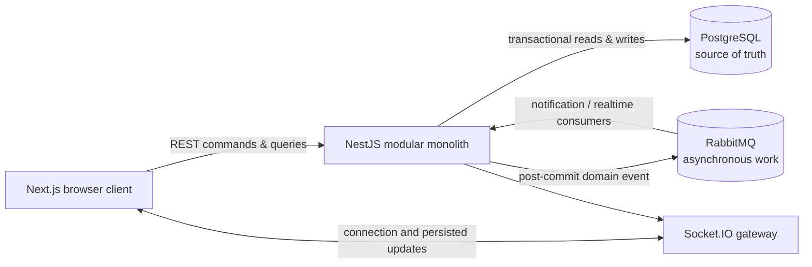
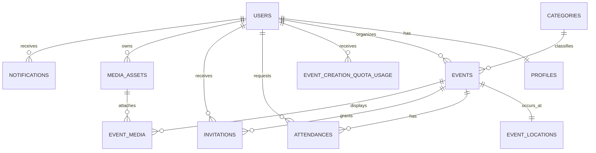
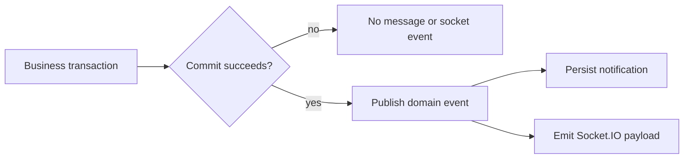

# Gatherly system design

> **Scope:** an intentionally local-first MVP for community events. The goal is not to simulate a large distributed platform; it is to make the difficult correctness boundaries explicit and implement them in a form that can evolve.

## 1. Problem and design thesis

Gatherly lets a **User** discover, create, and join local **Events**. The deceptively hard part is not showing an event card. It is preserving a truthful attendance and capacity model when users act concurrently, organizers make decisions, and connected browsers need timely updates.

The core thesis is:

> Put business truth and seat-allocation decisions in PostgreSQL transactions. Treat messages and sockets as post-commit distribution mechanisms, never as the authority that decides an outcome.

This gives the MVP a small operational footprint without hiding the production concerns it is intended to teach: authorization, state transitions, row locking, idempotency, event delivery, and real-time projection.

## 2. Requirements and explicit non-goals

### Functional requirements

- Discover Events by city, district, category, and time.
- Let a User create and manage only their own Events.
- Treat a Draft as a complete but unpublished Event, and consume Event Creation Quota when that Draft is created.
- Require `PRIVATE` Events to be Invite Only; permit Event editing only before its start time and preserve existing Confirmed Attendance when access rules change.
- Create the Organizer as a Confirmed Attendance, consuming one seat on a bounded Event.
- Support Public, Unlisted, and Private discovery rules independently from Open, Approval Required, and Invite Only join rules.
- Keep capacity correct for direct RSVP, organizer approval, cancellation, invitation acceptance, and waitlist promotion.
- Persist in-app notifications and publish real-time capacity updates after committed changes.
- Apply a monthly Event Creation Quota per User, stored as that User's monthly snapshot.

### Design constraints

- Runs locally through Docker Compose; no hosted deployment is required for the MVP.
- Starts as a NestJS modular monolith, not a fleet of services.
- Uses PostgreSQL, RabbitMQ, and Socket.IO because each exposes a real systems concern.
- Prioritizes deterministic correctness over premature throughput optimization.

### Non-goals

- Payments, subscription billing, and entitlement management.
- A general audit-event store or historical event sourcing.
- Cross-region availability, multi-tenancy, and independently deployable services.
- Exactly-once message delivery. Consumers must instead be safe under at-least-once delivery.

## 3. System context



The browser never changes capacity directly. RabbitMQ never owns attendance state. Socket.IO carries a view of a persisted result, not an instruction to decide one.

## 4. Module boundaries and ownership

The backend is a modular monolith: one deployable process with explicit internal ownership. Modules do not reach into one another's repositories.

| Module | Owns | Does not own |
| --- | --- | --- |
| `auth` | registration, credentials, verification, JWT, refresh sessions, current User context | profile presentation or Event permissions |
| `users` | Profile and monthly Event Creation Quota snapshot | Event metadata or seat allocation |
| `events` | Event metadata, Location, visibility, categories, organizer ownership | RSVP outcomes and capacity decisions |
| `attendance` | Attendance state machine, invitations, capacity, waitlist order | Event discovery queries |
| `notifications` | persisted in-app notification records and read state | business-state transitions |
| `messaging` | RabbitMQ publication and consumer lifecycle | transaction authority |
| `realtime` | Socket rooms and browser-facing persisted updates | authorization decisions beyond room admission |

`attendance` is the single transaction owner whenever a transition can consume or release a seat. This avoids split ownership of `confirmed_count`.

## 5. Domain model at a glance

The [domain glossary](../domain-glossary.md) supplies the canonical terms. The full schema is in [data-model.md](./data-model.md); the important relationships are:



Two distinctions prevent common event-platform failures:

- **Event Visibility** decides who can discover or view an Event; **Join Policy** decides how an eligible User can request attendance.
- **Invitation** grants eligibility only; it does not reserve a seat. Only a **Confirmed Attendance** consumes capacity.

### Quota as a monthly snapshot

`event_creation_quota_usage` represents a single User in a single UTC calendar month. It holds both the consumed count and the `monthly_event_limit` applicable to that User and month. The initial default is eight.

This is intentionally a snapshot rather than a shared global settings row. A future entitlement or paid-package flow can select a different limit when creating the monthly row, while a direct adjustment affects only the intended User and month. The model is therefore extensible without making an MVP payment system a dependency.

## 6. Consistency model and invariants

PostgreSQL is the authority for business truth. The following rules are contractual and are backed by a combination of database constraints and transactional application logic.

| Invariant | Enforcement |
| --- | --- |
| A User has at most one Attendance for an Event. | `unique(event_id, user_id)` |
| Only `CONFIRMED` Attendance consumes a seat. | state transition rules plus `events.confirmed_count` synchronization |
| Confirmed attendance never exceeds a bounded Event's capacity. | event-row lock, check, write, and counter update in one transaction |
| An Invitation never bypasses capacity. | acceptance enters the same attendance decision flow |
| A pending Invitation may expire or be revoked without retroactively changing Attendance. | Invitation lifecycle is separate after acceptance |
| An Organizer manages only Events they created. | authorization against `events.organizer_id` |
| A User cannot exceed their monthly creation quota. | locked/upserted quota row and `created_count < monthly_event_limit` check |
| Only a Verified User can perform trust-sensitive actions. | `email_verified_at` gate in command modules |
| Password reset or User suspension invalidates active sessions. | refresh-session revocation |
| An Organizer participates in their Event under the same capacity rule. | Event creation atomically creates the Organizer's Confirmed Attendance and initializes `confirmed_count` to one |
| A cancelled Attendance may be requested again; an Organizer rejection requires an Invitation to reopen participation. | Attendance transition rules distinguish cancellation from rejection |
| An Event has at most one cover image. | partial unique index on Event media role |
| Clients receive only persisted capacity state. | publish and emit occur after commit |

`confirmed_count` is a deliberate denormalized counter: it makes discovery and live capacity display cheap, but it is never client-supplied and can change only inside the seat-owning transaction.

## 7. Critical command flows

### 7.1 Create an Event

```mermaid
sequenceDiagram
    actor U as User
    participant API as Events API
    participant DB as PostgreSQL
    participant MQ as RabbitMQ
    participant RT as Socket.IO

    U->>API: POST /events
    API->>DB: begin; lock or upsert monthly quota row
    DB-->>API: created_count, monthly_event_limit
    alt quota available and Event is valid
        API->>DB: insert Event + Location; increment usage; commit
        API->>MQ: publish event.created
        API->>RT: emit persisted Event update
        API-->>U: 201 Created
    else quota exhausted or validation fails
        API->>DB: rollback
        API-->>U: 4xx problem response
    end
```

The quota check and increment are in the same transaction as Event creation. There is no gap where two concurrent requests can both observe the same remaining quota.

The created Event is a complete Draft. It is not discoverable or joinable until the Organizer publishes it. A Draft or a not-yet-started Published Event can be cancelled; Event cancellation does not rewrite Attendance state. A scheduled system process changes a Published Event to Completed once `ends_at` passes.

An Organizer may edit a Draft or not-yet-started Published Event. A Published Event's access or capacity change is distributed to active attendees after commit. Capacity may never drop below `confirmed_count`; an increase creates the same promotion opportunity as a confirmed cancellation. Publication requires only that the Event starts in the future.

Organizer revise, publish, and cancel commands use the Event version as an optimistic concurrency check, preventing a stale screen from silently replacing a newer Event revision.

Access-rule changes apply prospectively: active Attendance records retain access. Event cancellation preserves historical Attendance, revokes pending Invitations, and notifies active attendees and Invitation recipients. Unlisted share tokens are invalidated when visibility changes away from Unlisted and regenerated when it returns. Any capacity growth and resulting Open-policy promotion share one transaction.

An Organizer cannot be transferred in the MVP. Categories are platform-managed; an Organizer selects only an active Category. A finite capacity increase promotes as many FIFO-eligible Waitlisted Attendances as seats added, while an unlimited `OPEN` Event confirms all eligible Waitlisted Attendances in that transaction.

### 7.2 RSVP and final-seat contention

```mermaid
sequenceDiagram
    actor U as User
    participant API as Attendance API
    participant DB as PostgreSQL
    participant MQ as RabbitMQ
    participant RT as Socket.IO

    U->>API: POST /events/:eventId/rsvp
    API->>DB: begin; lock Event row
    API->>DB: load caller Attendance and join policy
    alt open policy and seat available
        API->>DB: write CONFIRMED Attendance; increment confirmed_count; commit
        API->>MQ: publish attendance.confirmed
        API->>RT: emit event.capacity.updated
        API-->>U: confirmed
    else approval required
        API->>DB: write PENDING Attendance; commit
        API-->>U: pending
    else full and caller explicitly chose waitlist
        API->>DB: write WAITLISTED Attendance; commit
        API-->>U: waitlisted
    else
        API->>DB: rollback
        API-->>U: rejected
    end
```

For a bounded Event, every seat-changing path locks the same Event row before it checks or changes `confirmed_count`. No new join, Organizer decision, or waitlist promotion is accepted at or after `starts_at`. Before then, a cancellation automatically promotes the oldest eligible Waitlisted Attendance for an `OPEN` Event; an `APPROVAL_REQUIRED` Event leaves only the oldest eligible Waitlisted Attendance for an Organizer decision. This serializes contention for a single Event without serializing unrelated Events.

### 7.3 Post-commit side effects



The MVP accepts a known failure window: a committed database change can exist when post-commit RabbitMQ publication fails. The failure is logged and PostgreSQL remains authoritative. A transactional outbox is the planned reliability upgrade once message-loss recovery becomes a real product requirement.

Consumers are idempotent: duplicate delivery must not duplicate notifications or mutate capacity a second time.

The notification MVP is in-app only. It persists one of the agreed Attendance, Invitation, Event revision, or Event cancellation facts and permits a User to list, mark one read, or mark all read; it has no email, push delivery, preference center, automatic retention policy, or notification-triggered business action. A payload contains presentation data and its target `eventId` only, so a click re-fetches current authorized truth. Different committed revisions remain separate rows, while RabbitMQ redelivery deduplicates through the notification key. A consumer persists a Notification before emitting its short summary to the recipient's authenticated `user:{userId}` room.

Socket.IO emits only committed change facts. `user:{userId}` carries that User's Notification, Attendance, Invitation, and private-access changes. A shared `event:{eventId}` room exists only for Public Events and carries a compact Event/capacity change signal. Unlisted and Private changes go only to affected User rooms; a Socket connection never carries a share token. Every client re-fetches the authorized query projection after an update.

## 8. Data access and privacy

Discovery queries are optimized for the read path:

- Event status, visibility, and start time support public listing and calendar windows.
- Category and time support category-filtered discovery.
- Location city and district support local discovery without exposing the exact address.
- Attendance indexes support Event roster/state reads and a User's upcoming calendar.

Authorization is evaluated before data projection. In particular, a Private Event's attendee list and precise address are never inferred from a share token or returned to an unauthorized User. Profiles expose names and selected presentation data under their own visibility rule; they do not expose contact details or attendance history.

A Profile exposes only first name, last name, bio, and authorized avatar. A User may edit it even before email verification. `EVENT_ATTENDEES` lets an Organizer review a requester to decide Attendance, while other Users must both have Confirmed Attendance in the same Event to see one another. `PRIVATE` restricts the Profile to its User except for that Organizer decision context. Visibility changes apply to every later Profile/avatar read. A User can also read their own current monthly Event Creation Quota usage, limit, and remaining count; it is not editable through the product.

General discovery is a PostgreSQL query over Public Events. It requires city and accepts district, Category, and date-range filters; the stable `starts_at, id` cursor returns at most fifty rows ordered by nearest start. Upcoming contains future Published Events and History preserves completed or cancelled plans. Cards can expose a map marker only where the configured location visibility permits it. An Event with an inactive Category remains in city results, though that Category is not offered as a filter. Unlisted and Private Events are excluded; an Unlisted detail needs valid share access, while a Private detail needs Organizer, active Attendance, or valid pending Invitation access. A Public Event remains directly viewable after it is Cancelled or Completed, with its status and no join action. A Personal Calendar also provides Upcoming and History views. Free-text search, relevance ranking, radius search, recommendations, cache, and a separate search index remain out of scope.

## 9. Failure modes and operational stance

| Failure | Expected behavior | Recovery / guardrail |
| --- | --- | --- |
| Two Users request the final seat | exactly one becomes Confirmed | row lock and one transaction boundary |
| Client retries an RSVP | no second Attendance is created | unique constraint and idempotent command handling |
| RabbitMQ is unavailable after commit | business result remains correct; notification may lag | log failure; reconcile later; outbox is a future upgrade |
| Socket client disconnects | it can miss a push update | REST re-fetch remains the source of current state |
| Duplicate consumer delivery | no duplicate visible side effect | idempotent notification/consumer logic and unique notification deduplication key |
| Media processing fails | asset is not attachable or visible | `media_assets.status` gate |

The local runtime has explicit health checks for PostgreSQL and RabbitMQ. Browser access is limited to the web app, API, Swagger, and RabbitMQ management UI; database and AMQP connections are local-development infrastructure.

The media MVP accepts only JPEG, PNG, and WebP images up to 10 MB. The API validates their actual metadata and writes them to a local Docker volume, then records a Ready Media Asset synchronously; it has no S3, CDN, presigned upload, video, or asynchronous conversion path. A User can choose one Profile avatar. Replacing it preserves the old ready asset for later reuse. An Organizer can attach only their own Ready assets to a pre-start Event, with at most one Cover and five Gallery images; setting a Cover replaces the earlier Cover atomically. A used asset must be detached before deletion. Media delivery checks the Profile or Event access rule for every request rather than publishing an unrestricted storage URL. Self-deletion marks every asset owned by that User Deleted and removes its Profile and Event Media links.

Email verification uses a local Mailpit adapter rather than a live email provider. The adapter delivers the same verification link and token flow to a local inbox, so verification remains testable without a domain, SMTP account, or external recipient. Registration creates an unverified but signed-in User; the Verified User gate limits its available actions. Verification resend is limited to one request per User per sixty seconds.

The MVP does not offer email-address changes. Passwords use Argon2id digests, have a minimum length of twelve, and are checked against a small versioned common-password deny list; it has no character-class rule. Password reset links expire in one hour and invalidate prior unused links. Reset and verification-resend requests return a generic result regardless of whether an email can receive a link; registration explicitly reports an existing email. A User may have up to five concurrent refresh sessions on multiple browsers or devices; a new sixth sign-in revokes the oldest session, while refresh rotation and normal logout affect only the presented one. The MVP has no device-management screen. Refresh secrets are delivered only via `HttpOnly`, `SameSite=Lax` cookies, with `Secure` enabled outside local HTTP development. Password change and self-deletion require the current password as re-authentication. A successful reset revokes all previous sessions and signs the requesting browser into one new session. Platform suspension blocks sign-in and revokes sessions. Self-deletion first revokes all pending Invitations addressed to the User, then irreversibly pseudonymizes User presentation data while preserving the identifier and historical Event/Attendance references; it permits a future registration with the original email as a wholly new User. It is unavailable until the User has cancelled every active future Attendance and every future Event they organize.

## 10. Validation strategy

The value of this design is in its executable invariants. The first integration suite should prove:

1. Final-seat contention yields one Confirmed Attendance and an accurate counter.
2. Duplicate RSVP cannot create duplicate Attendance.
3. Cancellation promotes the oldest eligible Waitlisted Attendance exactly once.
4. Visibility, join policy, Organizer ownership, and invitation eligibility cannot be bypassed.
5. A User cannot create more Events than their monthly snapshot allows.
6. Duplicate message delivery does not duplicate notifications or change capacity.

Unit tests validate state-transition rules; integration tests validate the database constraints, locks, and process boundaries that unit tests cannot faithfully simulate.

## 11. Evolution path

| Trigger | Next design move | Why it is deferred |
| --- | --- | --- |
| Need reliable post-commit delivery | transactional outbox + publisher | not required to establish transaction boundaries in the local MVP |
| Packages or paid quotas | entitlement source assigns `monthly_event_limit` when the monthly row is created | billing is explicitly out of scope |
| Heavy discovery traffic | read replica, cache, or search projection | PostgreSQL indexes are sufficient before measured pressure |
| Notification volume grows | dedicated consumer deployment | modules already communicate through named events |
| One module needs independent scale or release cadence | extract only that module behind an existing interface/event contract | premature services make transactions and local development harder |

## 12. Reading map

- [Application architecture](./application.md) explains the concrete module and runtime plan.
- [Data model](./data-model.md) defines every persisted tuple, constraint, and index.
- [Domain glossary](../domain-glossary.md) defines the vocabulary used throughout these documents.
