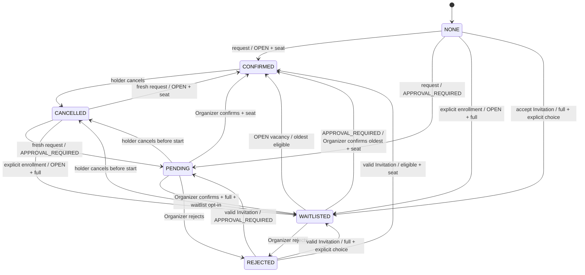

# Attendance design

This document applies the [application architecture](../architecture/application.md) pattern to Gatherly's highest-consistency module.

## 1. Purpose and ownership

The `attendance` module owns every post-creation decision that can consume or release an Event seat:

- a User requests Attendance;
- a User explicitly enrolls in a waitlist;
- an Organizer confirms or rejects a Pending or Waitlisted Attendance;
- a User accepts an Invitation;
- a User cancels their own Attendance;
- an `OPEN` Event promotes the oldest eligible Waitlisted Attendance after a vacancy.

`events` owns Event creation and atomically creates the Organizer's initial Confirmed Attendance. After creation, no other module writes an Attendance or changes `events.confirmed_count`.

PostgreSQL is authoritative. RabbitMQ and Socket.IO receive a committed result; neither selects an Attendance status or changes capacity.

## 2. External interface

The module has one external seam. Callers express an intent with a discriminated command and receive committed facts or a named business failure.

```ts
export interface AttendanceModule {
  decide(command: AttendanceCommand): Promise<AttendanceOutcome>;
}

export type AttendanceCommand =
  | RequestAttendance
  | EnrollWaitlist
  | DecideAttendance
  | AcceptInvitation
  | CancelAttendance;

export type RequestAttendance = {
  kind: 'REQUEST_ATTENDANCE';
  eventId: EventId;
  actorUserId: UserId;
  /** Used only if an Organizer later cannot confirm a Pending Attendance. */
  waitlistOptIn: boolean;
};

export type EnrollWaitlist = {
  kind: 'ENROLL_WAITLIST';
  eventId: EventId;
  actorUserId: UserId;
};

export type DecideAttendance = {
  kind: 'DECIDE_ATTENDANCE';
  eventId: EventId;
  attendanceId: AttendanceId;
  actorUserId: UserId;
  decision: 'CONFIRM' | 'REJECT';
  rejectionReason?: string;
};

export type AcceptInvitation = {
  kind: 'ACCEPT_INVITATION';
  invitationId: InvitationId;
  actorUserId: UserId;
  ifFull: 'REJECT' | 'JOIN_WAITLIST';
};

export type CancelAttendance = {
  kind: 'CANCEL_ATTENDANCE';
  eventId: EventId;
  actorUserId: UserId;
};

export type AttendanceOutcome = {
  attendance: {
    id: AttendanceId;
    userId: UserId;
    status: 'PENDING' | 'CONFIRMED' | 'WAITLISTED' | 'REJECTED' | 'CANCELLED';
    version: number;
  };
  capacity: {
    capacity: number | null;
    confirmedCount: number;
    availableCount: number | null;
  };
};
```

The interface does not expose ORM entities, transactions, row locks, RabbitMQ payloads, Socket.IO rooms, or `confirmed_count` mutation. This gives callers leverage while preserving locality for capacity rules.

## 3. Command semantics

| Command | Who may call it | Result |
| --- | --- | --- |
| `REQUEST_ATTENDANCE` | active User | `OPEN` Event with a seat becomes Confirmed; `APPROVAL_REQUIRED` becomes Pending; Invite Only requires a valid Invitation path. |
| `ENROLL_WAITLIST` | active User | Explicit Waitlist Enrollment for a full, joinable `OPEN` Event. It never occurs implicitly after a failed request. |
| `DECIDE_ATTENDANCE` | that Event's Organizer | confirms or rejects a Pending Attendance; for `APPROVAL_REQUIRED`, confirms or rejects only the oldest eligible Waitlisted Attendance. |
| `ACCEPT_INVITATION` | Invitation recipient | validates and accepts the Invitation, then applies the ordinary Join Policy and capacity rule. `ifFull` makes waitlisting explicit. |
| `CANCEL_ATTENDANCE` | Attendance holder | cancels their own active Attendance. The Organizer's initial Attendance cannot use this command. |

An Invitation grants eligibility, not a seat. An Invitation does not bypass `APPROVAL_REQUIRED`: accepting one creates a Pending Attendance in that policy. For Invite Only, a valid Invitation enables the ordinary capacity decision.

An Invitation can be accepted only while Pending and unexpired. Expiry or revocation prevents that acceptance. Once acceptance has created or reopened an Attendance, later expiry or revocation does not alter that Attendance; the Attendance state machine is then authoritative.

## 4. State machine



At or after `starts_at`, no request, Organizer decision, or promotion is permitted. Only a current Confirmed Attendance may be cancelled after the Event starts. Event cancellation does not mutate Attendance status: `events.status = CANCELLED` records that the Event will not occur, while the Attendance record preserves the User's last participation state.

`REJECTED` cannot return to an active state through another ordinary request. A valid Invitation is the explicit reopening path. An Event is completed without a check-in or no-show Attendance status in the MVP.

## 5. Capacity and ordering invariants

1. A User has one current Attendance record per Event: `unique(event_id, user_id)`.
2. Only `CONFIRMED` consumes capacity.
3. For a bounded Event, `0 <= confirmed_count <= capacity` always holds.
4. The Organizer's initial Confirmed Attendance consumes one bounded seat and cannot be cancelled independently.
5. Direct Waitlist Enrollment requires an explicit command and a full Event.
6. `OPEN` promotion is automatic and selects the oldest eligible Waitlisted Attendance.
7. `APPROVAL_REQUIRED` promotion permits the Organizer to decide only the oldest eligible Waitlisted Attendance.
8. A bounded Event promotes or confirms no Attendance at or after `starts_at`.

The canonical waitlist ordering is `waitlisted_at ASC, id ASC`. The identifier tie-breaker makes an ordering deterministic even when timestamps collide.

## 6. Transaction algorithm

Every `decide` call that changes state uses one PostgreSQL transaction.

```text
begin
  lock target Event row (FOR UPDATE)
  verify Event status, time, actor, Join Policy, and Event Visibility as relevant
  read target Attendance and Invitation as relevant
  evaluate the state transition
  write Attendance and Invitation changes
  synchronize confirmed_count when a seat changes
  if an OPEN Event seat was released before starts_at:
    lock and promote the oldest eligible Waitlisted Attendance
  commit

build committed domain events
dispatch after commit
```

The Event row is locked before an Attendance row is read or written. This order is stable for request, decision, cancellation, Invitation acceptance, and promotion. It serializes contention per Event while leaving unrelated Events independent.

For a full Event, a second command that waits on the lock observes the committed state produced by the first command. It therefore returns an ordinary capacity outcome rather than creating a second Confirmed Attendance.

## 7. Business outcomes

Expected business outcomes are explicit at the interface. HTTP mapping belongs to the HTTP adapter and does not change their meaning.

```text
EVENT_NOT_FOUND
EVENT_NOT_JOINABLE
ACTOR_NOT_ACTIVE
FORBIDDEN
INVITATION_REQUIRED
INVITATION_INVALID
ATTENDANCE_NOT_FOUND
INVALID_ATTENDANCE_TRANSITION
EVENT_AT_CAPACITY
WAITLIST_ENROLLMENT_REQUIRED
WAITLIST_UNAVAILABLE
```

Repeated commands are state-idempotent where possible. For example, a duplicate request cannot create a second Attendance because of the unique constraint; a duplicate cancellation returns the already cancelled outcome rather than releasing capacity twice. Infrastructure failures remain exceptional and never reinterpret a committed Attendance decision.

## 8. Committed distribution

The implementation constructs distribution events only after a successful commit. Versioned routing names include:

```text
attendance.confirmed.v1
attendance.pending.v1
attendance.waitlisted.v1
attendance.rejected.v1
attendance.cancelled.v1
attendance.promoted.v1
event.capacity.changed.v1
```

Every message contains `message_id`, `event_name`, `event_version`, `occurred_at`, `correlation_id`, `causation_id`, and a minimal payload. Notification consumers use a deterministic `deduplication_key` built from the recipient and committed event to tolerate duplicate RabbitMQ delivery.

Socket.IO receives only committed projections:

- `user:{userId}` receives that User's Attendance, Invitation, and notification changes;
- `event:{eventId}` receives capacity and public Event lifecycle changes after authorization;
- roster, rejection reason, and private Event information never enter a shared Event room.

A disconnected browser re-reads canonical state through a query; Socket.IO does not replay or decide state.

## 9. Integration-test contract

The `AttendanceModule.decide` interface is the test surface. Its PostgreSQL integration tests must prove:

1. Two concurrent requests for the final seat produce exactly one Confirmed Attendance.
2. A duplicate request never creates a second Attendance or increments capacity twice.
3. Invitation acceptance never bypasses capacity or `APPROVAL_REQUIRED`.
4. A full `OPEN` Event requires explicit Waitlist Enrollment.
5. Cancellation decrements capacity exactly once and automatically promotes the FIFO waitlist only for `OPEN`.
6. An `APPROVAL_REQUIRED` Event permits an Organizer to decide only the oldest eligible Waitlisted Attendance.
7. No request, decision, or promotion succeeds at or after `starts_at`.
8. A cancelled Attendance can be requested again; a rejected Attendance requires a valid Invitation.
9. An Organizer cannot cancel their initial Attendance independently of Event cancellation.
10. Duplicate consumer delivery produces one notification because its deduplication key is unique.

## 10. Implementation map

```text
apps/api/src/attendance/
  attendance.module.ts
  attendance.interface.ts
  attendance.commands.ts
  attendance.results.ts
  attendance.errors.ts
  attendance.implementation.ts
  attendance.persistence.ts
  attendance.events.ts
  attendance.http.ts
  attendance.integration-spec.ts
```

This is a responsibility map, not a requirement to produce shallow forwarding files. One PostgreSQL adapter is sufficient in the MVP; a generic repository seam would be hypothetical. RabbitMQ and Socket.IO dispatchers are real adapters because production dispatch and a recording test adapter both vary behind the post-commit dispatcher seam.

## 11. Related documents

- [System design](../architecture/system.md)
- [Application architecture](../architecture/application.md)
- [Data model](../architecture/data-model.md)
- [Domain glossary](../domain-glossary.md)
