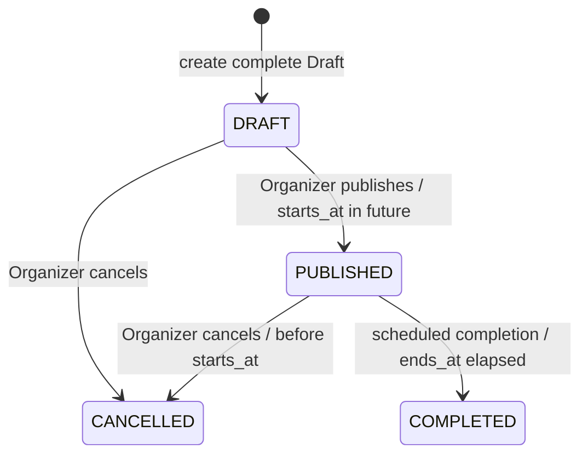

# Event design

This document applies the [application architecture](../architecture/application.md) pattern to Event creation, lifecycle, quota, access, and capacity coordination.

## 1. Purpose and ownership

The `events` module owns complete Draft creation, Event metadata, Event Location, Event Visibility, Join Policy, share-token lifecycle, cancellation, and scheduled completion. It owns the Event Creation Quota transaction because creating a Draft changes both the quota snapshot and the Event aggregate.

The `attendance` module owns every later decision that selects an Attendance or changes `confirmed_count`. The one coordination case is a pre-start capacity increase: Event metadata and the resulting `OPEN` FIFO promotion commit together, while Attendance implementation remains responsible for selecting and confirming the Waitlisted Attendance.

## 2. External interface

The module has one command seam. Discovery is a separate query module; it does not share this interface.

```ts
export interface EventModule {
  decide(command: EventCommand): Promise<EventOutcome>;
}

export type EventCommand =
  | CreateDraft
  | ReviseEvent
  | PublishEvent
  | CancelEvent
  | CompleteDueEvents;

export type CreateDraft = {
  kind: 'CREATE_DRAFT';
  /** Generated by the calling adapter and reused if that creation request is retried. */
  eventId: EventId;
  actorUserId: UserId;
  definition: CompleteEventDefinition;
};

export type ReviseEvent = {
  kind: 'REVISE_EVENT';
  eventId: EventId;
  actorUserId: UserId;
  expectedVersion: number;
  definition: CompleteEventDefinition;
};

export type PublishEvent = {
  kind: 'PUBLISH_EVENT';
  eventId: EventId;
  actorUserId: UserId;
  expectedVersion: number;
};

export type CancelEvent = {
  kind: 'CANCEL_EVENT';
  eventId: EventId;
  actorUserId: UserId;
  expectedVersion: number;
};

export type CompleteDueEvents = {
  kind: 'COMPLETE_DUE_EVENTS';
};

export type CompleteEventDefinition = {
  categoryId: CategoryId;
  title: string;
  description: string;
  startsAt: Instant;
  endsAt: Instant;
  timezone: string;
  capacity: number | null;
  visibility: 'PUBLIC' | 'UNLISTED' | 'PRIVATE';
  joinPolicy: 'OPEN' | 'APPROVAL_REQUIRED' | 'INVITE_ONLY';
  location: EventLocationInput;
};

export type EventOutcome = {
  kind:
    | 'DRAFT_CREATED'
    | 'EVENT_REVISED'
    | 'EVENT_PUBLISHED'
    | 'EVENT_CANCELLED'
    | 'DUE_EVENTS_COMPLETED';
  event?: EventSnapshot;
  capacity?: CapacitySnapshot;
  completedEventIds?: EventId[];
};
```

The caller supplies a complete desired Event definition, never a persistence-shaped patch. The module derives `share_token`, `status`, `confirmed_count`, quota period, row locks, transaction context, and distribution payloads internally.

`eventId` makes Draft creation retry-safe without a generic command-log table: on a duplicate identifier, the implementation returns the existing Draft only when it belongs to the same Organizer and represents the same creation intent; an identifier collision is rejected. Revise, publish, and cancel use `expectedVersion`; their repeated execution observes a committed state or returns an explicit version conflict.

## 3. Lifecycle state machine



There is no physical Event deletion, no ownership transfer, no publication of an expired Draft, no cancellation after start time, and no transition out of `CANCELLED` or `COMPLETED` in the MVP.

A Draft is complete but unavailable for discovery and attendance. Creating it consumes Event Creation Quota and never refunds that quota. A Published Event may be revised only before start time; publish also requires a future `starts_at`.

## 4. Definition invariants

Every `CompleteEventDefinition` is evaluated as a whole:

1. Category is platform-managed and active at Draft creation. A revision may retain an Event's existing inactive Category but cannot newly select an inactive Category.
2. `ends_at > starts_at`.
3. A finite capacity is positive and never below `confirmed_count`.
4. A finite capacity at Draft creation is at least one because the Organizer is immediately Confirmed.
5. `PRIVATE` requires `INVITE_ONLY`; Public and Unlisted accept any Join Policy.
6. City and district are always present; precise address obeys its own visibility rule.
7. Unlisted has a share token. Entering or re-entering Unlisted generates a new token; leaving it clears the token.
8. Organizer is immutable.

Access changes apply prospectively. Existing Confirmed, Pending, and Waitlisted Attendances keep their active access; new requests use the revised Event Visibility and Join Policy.

## 5. Command semantics

| Command | Who calls it | Transaction result |
| --- | --- | --- |
| `CREATE_DRAFT` | active User | locks or upserts the monthly quota row; creates complete Draft, Location, Organizer Confirmed Attendance, and `confirmed_count = 1`; increments quota. |
| `REVISE_EVENT` | immutable Organizer | locks the Event; verifies expected version, state, time, and full definition; updates Event/Location/access and coordinates any promotion. |
| `PUBLISH_EVENT` | immutable Organizer | locks Draft; verifies expected version and future start; marks Published. |
| `CANCEL_EVENT` | immutable Organizer | locks Draft or pre-start Published Event; marks Cancelled, revokes pending Invitations, and preserves Attendance history. |
| `COMPLETE_DUE_EVENTS` | scheduled adapter | claims due Published Events, changes them to Completed, and returns the completed identifiers. |

`COMPLETE_DUE_EVENTS` is idempotent. It uses the implementation's clock and locks each due Event so concurrent scheduler executions cannot complete the same Event twice.

## 6. Capacity coordination

Capacity changes are valid only before the Event starts.

```text
lock Event row
verify Organizer, version, timing, and new capacity
write Event capacity
if capacity produced new availability:
  Attendance implementation selects eligible waitlist records FIFO
  OPEN: confirm one per newly available seat, or all if unlimited
  APPROVAL_REQUIRED: leave waitlist for Organizer decision
commit Event and Attendance changes together
```

The stable lock order is Event first, then Waitlisted Attendances ordered by `waitlisted_at ASC, id ASC`. A concurrent request observes the committed capacity and cannot bypass the waitlist during this operation.

The Event implementation sends only a capacity-change intent through its internal seam. It never chooses a specific Attendance, calculates the new `confirmed_count`, or implements promotion rules.

## 7. Concurrency and business failures

Every Organizer mutation carries `expectedVersion`. When it differs from the locked Event's version, the command returns `EVENT_VERSION_CONFLICT` without writing anything.

Expected outcomes include:

```text
EVENT_NOT_FOUND
ACTOR_NOT_ACTIVE
NOT_ORGANIZER
EVENT_NOT_EDITABLE
EVENT_NOT_PUBLISHABLE
EVENT_NOT_CANCELLABLE
EVENT_VERSION_CONFLICT
EVENT_CREATION_QUOTA_EXHAUSTED
CATEGORY_INACTIVE
INVALID_EVENT_TIMING
INVALID_EVENT_DEFINITION
PRIVATE_EVENT_REQUIRES_INVITE_ONLY
CAPACITY_BELOW_CONFIRMED_COUNT
```

Unexpected PostgreSQL, dispatcher, or scheduled-runtime failures remain exceptional. A distribution failure after a successful commit never rolls an Event back.

## 8. Committed distribution

The module constructs distribution events only after a successful commit:

```text
event.published.v1
event.revised.v1
event.cancelled.v1
event.completed.v1
event.capacity.changed.v1
invitation.revoked.v1
```

Draft creation has no discovery or attendee distribution. A published revision notifies active attendees. Cancellation notifies Confirmed, Pending, and Waitlisted Users as well as recipients of revoked pending Invitations. Completion does not create a check-in, no-show, or Attendance transition in the MVP.

Socket.IO projects committed Event lifecycle and capacity facts only. An Unlisted share token, private address, roster, and rejection reason never enter a shared Event room.

## 9. Integration-test contract

The EventModule interface is the test surface. PostgreSQL integration tests must prove:

1. Two concurrent Draft requests at the last quota slot create exactly one Event.
2. Draft, Location, quota increment, Organizer Attendance, and `confirmed_count = 1` commit or roll back together.
3. The same Draft creation identifier does not consume quota twice.
4. Inactive Category, incomplete definition, invalid timing, and invalid visibility/Join Policy combinations are rejected.
5. A stale revise, publish, or cancel command receives `EVENT_VERSION_CONFLICT`.
6. Publish requires a future start; revise and cancel fail at or after start time.
7. Unlisted token rotation makes an old link unusable.
8. Capacity cannot drop below Confirmed Attendance; a finite increase atomically promotes FIFO Waitlisted Attendance for Open policy.
9. Unlimited Open capacity confirms every eligible Waitlisted Attendance; Approval Required capacity changes confirm none automatically.
10. Cancelled Event preserves Attendance, revokes pending Invitations, and emits the correct committed facts.
11. Concurrent scheduled runs complete every due Published Event at most once.

## 10. Implementation map

```text
apps/api/src/events/
  events.module.ts
  events.interface.ts
  events.commands.ts
  events.results.ts
  events.errors.ts
  events.implementation.ts
  events.persistence.ts
  events.events.ts
  events.http.ts
  events.scheduler.ts
  events.integration-spec.ts
```

This is a responsibility map, not a requirement for shallow forwarding files. PostgreSQL persistence remains inside the implementation because a generic repository seam would be hypothetical. The scheduled adapter and post-commit dispatcher are real adapters: both have production behaviour and deterministic test doubles.

## 11. Related documents

- [System design](../architecture/system.md)
- [Application architecture](../architecture/application.md)
- [Attendance design](./attendance.md)
- [Data model](../architecture/data-model.md)
- [Domain glossary](../domain-glossary.md)
