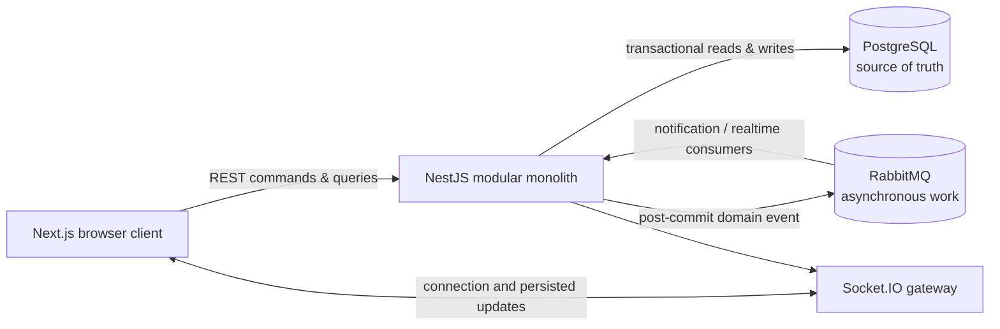
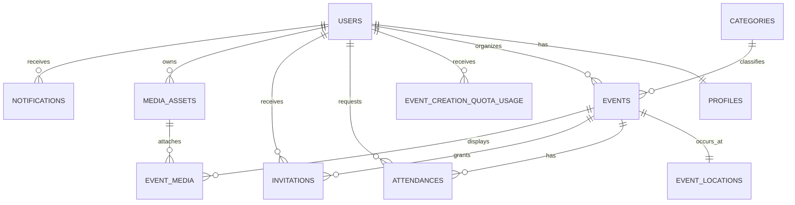
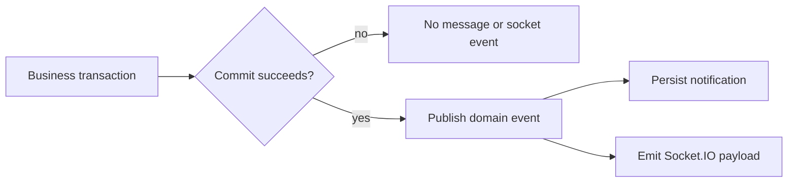

# Gatherly system design

> **Scope:** an intentionally local-first MVP for community events. The goal is not to simulate a large distributed platform; it is to make the difficult correctness boundaries explicit and implement them in a form that can evolve.

## 1. Problem and design thesis

Gatherly lets a **User** discover, create, and join local **Events**. The deceptively hard part is not showing an event card. It is preserving a truthful attendance and capacity model when users act concurrently, organizers make decisions, and connected browsers need timely updates.

The core thesis is:

> Put business truth and seat-allocation decisions in PostgreSQL transactions. Treat messages and sockets as post-commit distribution mechanisms, never as the authority that decides an outcome.

This gives the MVP a small operational footprint without hiding the production concerns it is intended to teach: authorization, state transitions, row locking, idempotency, event delivery, and real-time projection.

## 2. Requirements and explicit non-goals

### Functional requirements

- Discover Events by city, district, category, and time.
- Let a User create and manage only their own Events.
- Support Public, Unlisted, and Private discovery rules independently from Open, Approval Required, and Invite Only join rules.
- Keep capacity correct for direct RSVP, organizer approval, cancellation, invitation acceptance, and waitlist promotion.
- Persist in-app notifications and publish real-time capacity updates after committed changes.
- Apply a monthly Event Creation Quota per User, stored as that User's monthly snapshot.

### Design constraints

- Runs locally through Docker Compose; no hosted deployment is required for the MVP.
- Starts as a NestJS modular monolith, not a fleet of services.
- Uses PostgreSQL, RabbitMQ, and Socket.IO because each exposes a real systems concern.
- Prioritizes deterministic correctness over premature throughput optimization.

### Non-goals

- Payments, subscription billing, and entitlement management.
- A general audit-event store or historical event sourcing.
- Cross-region availability, multi-tenancy, and independently deployable services.
- Exactly-once message delivery. Consumers must instead be safe under at-least-once delivery.

## 3. System context



The browser never changes capacity directly. RabbitMQ never owns attendance state. Socket.IO carries a view of a persisted result, not an instruction to decide one.

## 4. Module boundaries and ownership

The backend is a modular monolith: one deployable process with explicit internal ownership. Modules do not reach into one another's repositories.

| Module | Owns | Does not own |
| --- | --- | --- |
| `auth` | registration, credentials, JWT, current User context | profile presentation or Event permissions |
| `users` | Profile and monthly Event Creation Quota snapshot | Event metadata or seat allocation |
| `events` | Event metadata, Location, visibility, categories, organizer ownership | RSVP outcomes and capacity decisions |
| `attendance` | Attendance state machine, invitations, capacity, waitlist order | Event discovery queries |
| `notifications` | persisted in-app notification records and read state | business-state transitions |
| `messaging` | RabbitMQ publication and consumer lifecycle | transaction authority |
| `realtime` | Socket rooms and browser-facing persisted updates | authorization decisions beyond room admission |

`attendance` is the single transaction owner whenever a transition can consume or release a seat. This avoids split ownership of `confirmed_count`.

## 5. Domain model at a glance

The [domain glossary](../CONTEXT.md) supplies the canonical terms. The full schema is in [data-model.md](./data-model.md); the important relationships are:



Two distinctions prevent common event-platform failures:

- **Event Visibility** decides who can discover or view an Event; **Join Policy** decides how an eligible User can request attendance.
- **Invitation** grants eligibility only; it does not reserve a seat. Only a **Confirmed Attendance** consumes capacity.

### Quota as a monthly snapshot

`event_creation_quota_usage` represents a single User in a single calendar month. It holds both the consumed count and the `monthly_event_limit` applicable to that User and month. The initial default is eight.

This is intentionally a snapshot rather than a shared global settings row. A future entitlement or paid-package flow can select a different limit when creating the monthly row, while a direct adjustment affects only the intended User and month. The model is therefore extensible without making an MVP payment system a dependency.

## 6. Consistency model and invariants

PostgreSQL is the authority for business truth. The following rules are contractual and are backed by a combination of database constraints and transactional application logic.

| Invariant | Enforcement |
| --- | --- |
| A User has at most one Attendance for an Event. | `unique(event_id, user_id)` |
| Only `CONFIRMED` Attendance consumes a seat. | state transition rules plus `events.confirmed_count` synchronization |
| Confirmed attendance never exceeds a bounded Event's capacity. | event-row lock, check, write, and counter update in one transaction |
| An Invitation never bypasses capacity. | acceptance enters the same attendance decision flow |
| An Organizer manages only Events they created. | authorization against `events.organizer_id` |
| A User cannot exceed their monthly creation quota. | locked/upserted quota row and `created_count < monthly_event_limit` check |
| An Event has at most one cover image. | partial unique index on Event media role |
| Clients receive only persisted capacity state. | publish and emit occur after commit |

`confirmed_count` is a deliberate denormalized counter: it makes discovery and live capacity display cheap, but it is never client-supplied and can change only inside the seat-owning transaction.

## 7. Critical command flows

### 7.1 Create an Event

```mermaid
sequenceDiagram
    actor U as User
    participant API as Events API
    participant DB as PostgreSQL
    participant MQ as RabbitMQ
    participant RT as Socket.IO

    U->>API: POST /events
    API->>DB: begin; lock or upsert monthly quota row
    DB-->>API: created_count, monthly_event_limit
    alt quota available and Event is valid
        API->>DB: insert Event + Location; increment usage; commit
        API->>MQ: publish event.created
        API->>RT: emit persisted Event update
        API-->>U: 201 Created
    else quota exhausted or validation fails
        API->>DB: rollback
        API-->>U: 4xx problem response
    end
```

The quota check and increment are in the same transaction as Event creation. There is no gap where two concurrent requests can both observe the same remaining quota.

### 7.2 RSVP and final-seat contention

```mermaid
sequenceDiagram
    actor U as User
    participant API as Attendance API
    participant DB as PostgreSQL
    participant MQ as RabbitMQ
    participant RT as Socket.IO

    U->>API: POST /events/:eventId/rsvp
    API->>DB: begin; lock Event row
    API->>DB: load caller Attendance and join policy
    alt open policy and seat available
        API->>DB: write CONFIRMED Attendance; increment confirmed_count; commit
        API->>MQ: publish attendance.confirmed
        API->>RT: emit event.capacity.updated
        API-->>U: confirmed
    else approval required
        API->>DB: write PENDING Attendance; commit
        API-->>U: pending
    else full and caller explicitly chose waitlist
        API->>DB: write WAITLISTED Attendance; commit
        API-->>U: waitlisted
    else
        API->>DB: rollback
        API-->>U: rejected
    end
```

For a bounded Event, every seat-changing path locks the same Event row before it checks or changes `confirmed_count`. A cancellation and a waitlist promotion use the same ownership boundary. This serializes contention for a single Event without serializing unrelated Events.

### 7.3 Post-commit side effects



The MVP accepts a known failure window: a committed database change can exist when post-commit RabbitMQ publication fails. The failure is logged and PostgreSQL remains authoritative. A transactional outbox is the planned reliability upgrade once message-loss recovery becomes a real product requirement.

Consumers are idempotent: duplicate delivery must not duplicate notifications or mutate capacity a second time.

## 8. Data access and privacy

Discovery queries are optimized for the read path:

- Event status, visibility, and start time support public listing and calendar windows.
- Category and time support category-filtered discovery.
- Location city and district support local discovery without exposing the exact address.
- Attendance indexes support Event roster/state reads and a User's upcoming calendar.

Authorization is evaluated before data projection. In particular, a Private Event's attendee list and precise address are never inferred from a share token or returned to an unauthorized User. Profiles expose names and selected presentation data under their own visibility rule; they do not expose contact details or attendance history.

## 9. Failure modes and operational stance

| Failure | Expected behavior | Recovery / guardrail |
| --- | --- | --- |
| Two Users request the final seat | exactly one becomes Confirmed | row lock and one transaction boundary |
| Client retries an RSVP | no second Attendance is created | unique constraint and idempotent command handling |
| RabbitMQ is unavailable after commit | business result remains correct; notification may lag | log failure; reconcile later; outbox is a future upgrade |
| Socket client disconnects | it can miss a push update | REST re-fetch remains the source of current state |
| Duplicate consumer delivery | no duplicate visible side effect | idempotent notification/consumer logic |
| Media processing fails | asset is not attachable or visible | `media_assets.status` gate |

The local runtime has explicit health checks for PostgreSQL and RabbitMQ. Browser access is limited to the web app, API, Swagger, and RabbitMQ management UI; database and AMQP connections are local-development infrastructure.

## 10. Validation strategy

The value of this design is in its executable invariants. The first integration suite should prove:

1. Final-seat contention yields one Confirmed Attendance and an accurate counter.
2. Duplicate RSVP cannot create duplicate Attendance.
3. Cancellation promotes the oldest eligible Waitlisted Attendance exactly once.
4. Visibility, join policy, Organizer ownership, and invitation eligibility cannot be bypassed.
5. A User cannot create more Events than their monthly snapshot allows.
6. Duplicate message delivery does not duplicate notifications or change capacity.

Unit tests validate state-transition rules; integration tests validate the database constraints, locks, and process boundaries that unit tests cannot faithfully simulate.

## 11. Evolution path

| Trigger | Next design move | Why it is deferred |
| --- | --- | --- |
| Need reliable post-commit delivery | transactional outbox + publisher | not required to establish transaction boundaries in the local MVP |
| Packages or paid quotas | entitlement source assigns `monthly_event_limit` when the monthly row is created | billing is explicitly out of scope |
| Heavy discovery traffic | read replica, cache, or search projection | PostgreSQL indexes are sufficient before measured pressure |
| Notification volume grows | dedicated consumer deployment | modules already communicate through named events |
| One module needs independent scale or release cadence | extract only that module behind an existing interface/event contract | premature services make transactions and local development harder |

## 12. Reading map

- [Architecture](./architecture.md) explains the concrete module and runtime plan.
- [Data model](./data-model.md) defines every persisted tuple, constraint, and index.
- [ADR 0001](./adr/0001-modular-monolith.md) records why Gatherly begins as a modular monolith.
- [Domain glossary](../CONTEXT.md) defines the vocabulary used throughout these documents.

